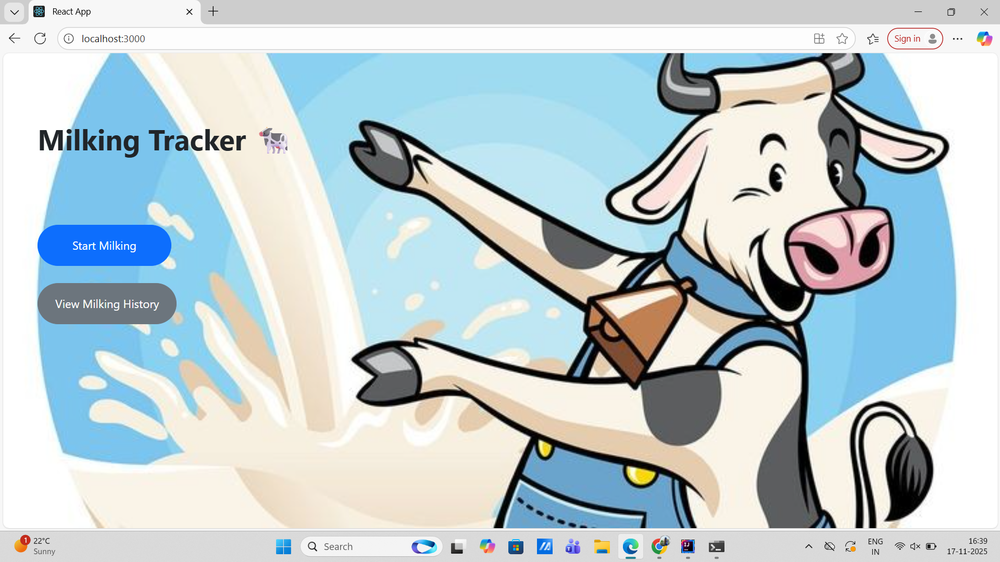
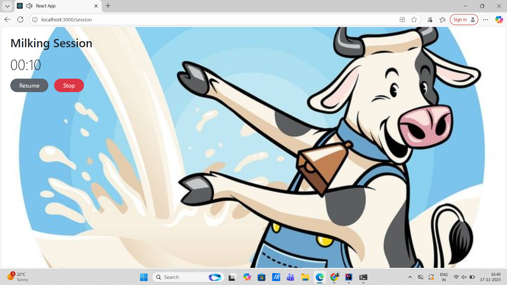
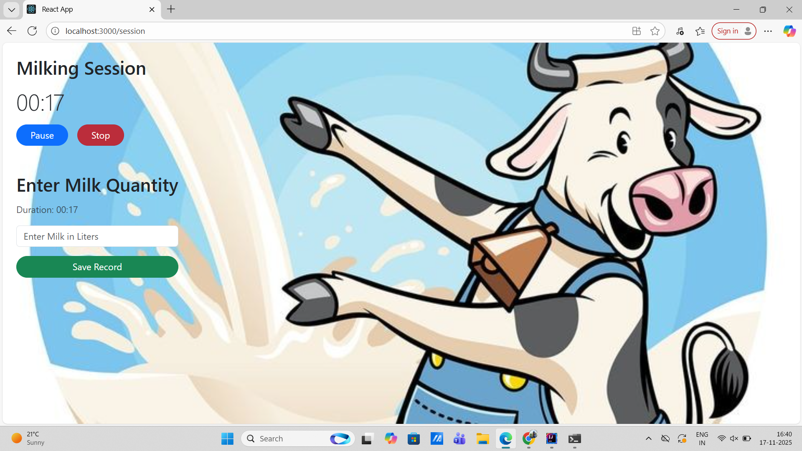
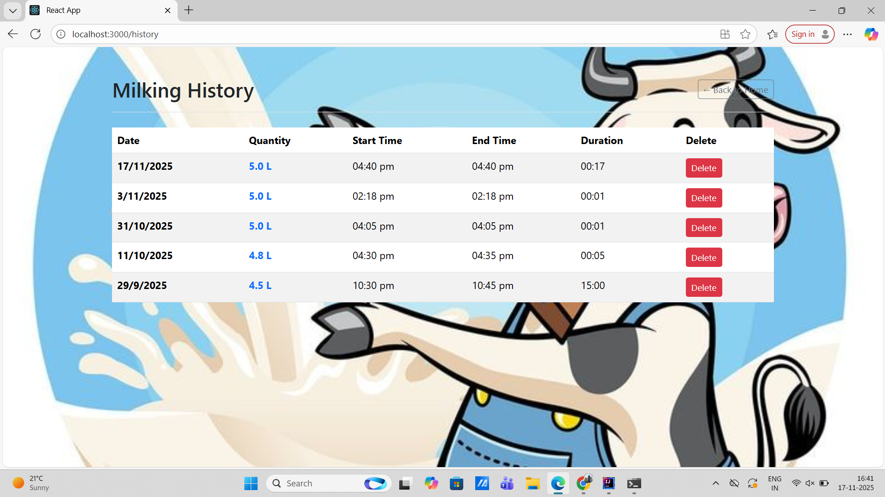

# Milking Tracker 

This application is built using the React.js library and serves as the user interface for tracking livestock milking sessions. It is designed to be a fully responsive client that interacts with a separate REST API backend to store and retrieve data.

The application allows users to effectively manage and log milking records, providing insights into duration and volume.

# How to Set Up and Run the Project

Ensure you have Node.js and npm installed.

* Clone the repository using "git clone repository_url"
* Open the folder in any editor. Example- VS Code
* Run command "npm install"
* REACT_APP_API_BASE_URL="http://localhost:8080/api"
* Then run "npm start" to start the app.

# Key Features

Session Timer: Start and Stop functionality to accurately measure milking duration.
Historical Log: Display of all saved records, including date, time, duration.

# Tech Stack

Frontend Library: React.js

Styling: Bootstrap css

State Management: React Hooks

API Interaction: Standard fetch or Axios

# Screenshots
Home Screen
Running Session
Paused Session
Resume Session
Enter Quantity
Milking History